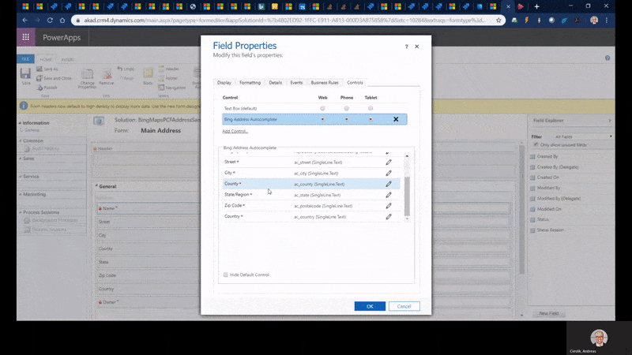
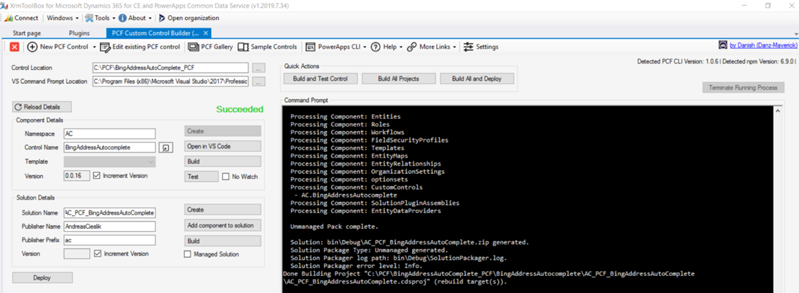

# Bing Address Autocomplete PCF Control

To use the control you are required to use a Bing API key. Depending on your licence plan for Dynamics 365 you can find your API through the "Resource Scheduling" app.

Once the app is open, navigate to Settings -> Administration -> Scheduling Parameters. From this configuration record you can copy the content of "Map Api Key" field to the Bing Address Autocomplete controls Bing API key field and bound the value as a static value.

To build the PCF control you can you XrmToolBox together with the PCF Custom Control Builder plugin:

More details in my blog post:
https://code2life.blogspot.com/2019/11/yet-another-address-autocomplete-pcf.html

